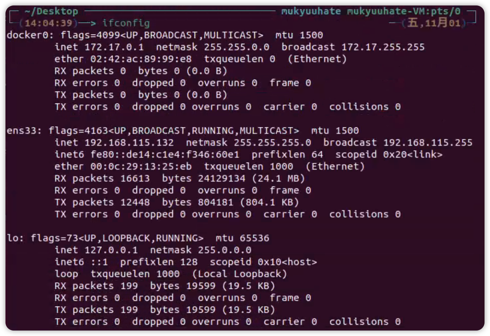
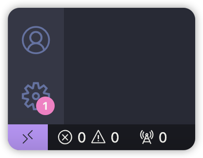

# Environment 

> 实验所需基础环境为ubuntu 20.04 x64 System
>
> 可以使用物理机/VMWare/wsl等环境


## 下载地址

ubuntu 20.04：https://releases.ubuntu.com/20.04/ubuntu-20.04.6-desktop-amd64.iso

vmware：https://support.broadcom.com/group/ecx/productdownloads?subfamily=VMware+Workstation+Pro

如果连接了ucas网络可以在此下载：http://10.200.98.215:8080


## 基础环境

```bash
sudo apt update
sudo apt install -y vim gcc g++ build-essential make git uuid-dev libssl-dev pkg-config
```

注：以上操作可以通过换源加快速度，例修改为清华源，修改`/etc/apt/sources.list`为如下内容，再执行上述操作

```bash
# 默认注释了源码镜像以提高 apt update 速度，如有需要可自行取消注释
deb http://mirrors.tuna.tsinghua.edu.cn/ubuntu/ focal main restricted universe multiverse
# deb-src http://mirrors.tuna.tsinghua.edu.cn/ubuntu/ focal main restricted universe multiverse
deb http://mirrors.tuna.tsinghua.edu.cn/ubuntu/ focal-updates main restricted universe multiverse
# deb-src http://mirrors.tuna.tsinghua.edu.cn/ubuntu/ focal-updates main restricted universe multiverse
deb http://mirrors.tuna.tsinghua.edu.cn/ubuntu/ focal-backports main restricted universe multiverse
# deb-src http://mirrors.tuna.tsinghua.edu.cn/ubuntu/ focal-backports main restricted universe multiverse
deb http://mirrors.tuna.tsinghua.edu.cn/ubuntu/ focal-security main restricted universe multiverse
# deb-src http://mirrors.tuna.tsinghua.edu.cn/ubuntu/ focal-security main restricted universe multiverse

# 预发布软件源，不建议启用
# deb http://mirrors.tuna.tsinghua.edu.cn/ubuntu/ focal-proposed main restricted universe multiverse
# deb-src http://mirrors.tuna.tsinghua.edu.cn/ubuntu/ focal-proposed main restricted universe multiverse
```


## cmake 环境

安装`cmake`，`cmake`版本`3.16.3`

```bash
sudo apt-get install cmake
```

安装`RapidJson`
```bash
# 方法一
git clone https://github.com/Tencent/rapidjson
cd rapidjson && git submodule update --init
mkdir build && cd build
cmake ..
make
sudo make install

# 方法二
sudo apt-get install rapidjson-dev

# 方法三
git clone https://github.com/Tencent/rapidjson
cd rapidjson && git submodule update --init
cd include
sudo cp -rf ./rapidjson /usr/include
sudo cp -rf ./rapidjson /usr/local/include
```


## Java环境

`antlr4`赖于`java`环境，因此需要先配置`java`

安装`java`

```bash
sudo apt-get install openjdk-17-jdk
```


## ANTLR4环境

安装`antlr4`版本`4.9.3`

```bash
sudo apt-get install curl
cd /tmp
curl -O https://www.antlr.org/download/antlr-4.9.3-complete.jar
sudo mv ./antlr-4.9.3-complete.jar /usr/local/lib/
```

配置`antlr4 jar`包环境变量，在`~/.bashrc`文件中的最后添加如下代码

```bash
# antlr env
export CLASSPATH=".:/usr/local/lib/antlr-4.9.3-complete.jar:$CLASSPATH"
alias antlr='java -Xmx500M -cp "/usr/local/lib/antlr-4.9.3-complete.jar:$CLASSPATH" org.antlr.v4.Tool'
alias grun='java -Xmx500M -cp "/usr/local/lib/antlr-4.9.3-complete.jar:$CLASSPATH" org.antlr.v4.gui.TestRig'
```

保存后，执行`source ~/.bashrc`，可立即生效修改后的配置

注：如果是其他的`shell`可自行找`resource configure`文件进行修改


## LLVM环境

```bash
# 方式一
sudo apt-get install llvm-15
sudo apt-get install clang-15

# 方式二
sudo wget https://apt.llvm.org/llvm.sh 
sudo chmod +x llvm.sh
sudo ./llvm.sh 15
sudo apt-get install clang-15
sudo update-alternatives --install /usr/bin/clang clang /usr/bin/clang-15 2
sudo update-alternatives --install /usr/bin/clang++ clang++ /usr/bin/clang++-15 2
```


## Github访问超时

修改host文件，使用命令`sudo gedit /etc/hosts`

在末尾加上以下内容

```
140.82.112.3 github.com
151.101.1.6 github.global.ssl.fastly.net
151.101.65.6 github.global.ssl.fastly.net
151.101.129.6 github.global.ssl.fastly.net
151.101.193.6 github.global.ssl.fastly.net
```


## 开发环境（可选）

### vscode 

#### vscode扩展

1. 在VS code内安装Remote-SSH扩展

2. 打开Remote-SSH扩展设置，添加Remote.SSH:PATH

   

   1. 打开本机电脑终端窗口，输入命令：  for %x in (ssh.exe) do @echo %~$PATH:x
   2. 将获取到的地址填入Remote.SSH:PATH


#### 虚拟机环境准备

1. 安装ssh-server :  `sudo apt-get install openssh-server`

2. 安装net-tools:   `sudo apt install net-tools`

3. 获取虚拟机地址： `ifconfig`

   

 

#### 设置虚拟机链接

1. 点击VS code左下角“打开远程窗口”按钮，进入链接配置。

   

2. 点击“connect to Host...”

3. 点击”+ ADD NEW SSH HOST... 

4. 输入：ssh 虚拟机用户名@虚拟机地址 -A  例：ssh ubuntu8@192.168.31.148 -A

5. 点击”Enter”完成设置

#### 链接虚拟机

1. 点击VS code左下角“打开远程窗口”按钮，进行虚拟机链接。

2. 点击“connect to Host...”

3. 点击希望链接的虚拟机地址

4. 选择虚拟机对应的系统

###  clion

也可以远程代码

下载链接：https://www.jetbrains.com/clion/