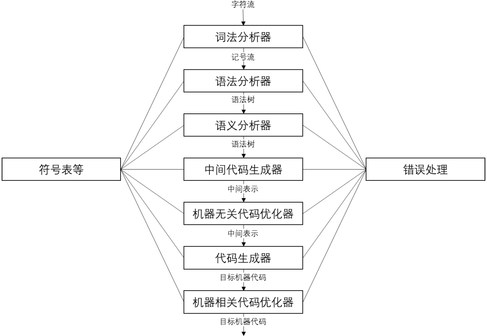

> 实验文档、代码处于迭代更新过程中，如有错误或建议，欢迎同学们联系实验助教提PR。

## 实验目的

1. 熟悉LLVM IR表示。
2. 熟悉LLVM IR生成相关接口。


## 实验任务

1. 基于实验一生成的抽象语法树，生成测例的LLVM IR。
2. 对部分语义错误进行编译时静态检查和报错。
3. 对访问obc数组的语句进行插入用于数组越界访问检测的IR代码，进行动态检查和报错。


## 实验内容

实验一中，我们为`SafeC`代码生成了抽象语法树，在本实验中，我们将更近一步，基于LLVM为其生成中间表示（LLVM IR），并在生成过程中完成简单的语义检查和插入obc数组访问检查代码。

IR生成后，实验框架会使用LLVM IR执行引擎执行生成的IR，以验证其正确性。




### LLVM IR生成

在本次实验的第一步中，我们仍将基于访问者模式，但访问的对象变为了抽象语法树，目标是利用LLVM提供的接口生成LLVM IR。

##### 简单的LLVM IR示例

建议阅读`Getting Started with LLVM Core Libraries`的[第五章](https://getting-started-with-llvm-core-libraries-zh-cn.readthedocs.io/zh_CN/latest/ch05.html)中`IR层次优化`之前的内容了解LLVM IR的特点和基本生成方法。本文档中仅摘取其中部分内容对LLVM IR的基本特性做简要介绍。

以如下简单求和代码为例：

````cpp
int sum(int a, int b) {
  return a+b;
}
````

通过如下命令可以生成该代码的LLVM IR：

````sh
clang sum.c -emit-llvm -S -c -o sum.ll
````

生成的`sum.ll`文件中包含上述代码的IR以及部分附属信息，主要的IR代码如下：

````c
define dso_local i32 @sum(i32 noundef %0, i32 noundef %1) #0 {
  %3 = alloca i32, align 4
  %4 = alloca i32, align 4
  store i32 %0, i32* %3, align 4
  store i32 %1, i32* %4, align 4
  %5 = load i32, i32* %3, align 4
  %6 = load i32, i32* %4, align 4
  %7 = add nsw i32 %5, %6
  ret i32 %7
}
````

IR中，以`%`开头的标识符表示一个寄存器，寄存器中可能存储地址或者数值。地址寄存器通过`alloca`、`store`、`load`指令分配地址、存储数值和加载数值，`alloca`指令相当于在栈桢上分配了指定大小的内存空间，然后将其地址赋给该地址寄存器。

LLVM IR有如下基本性质：

+ 它采用**静态单赋值（SSA）**形式。注意没有一个值是被重复赋值的；每个值只有单一赋值定义了它。每次使用一个值，可以立刻向后追溯到给出其定义的唯一的指令。在后续编译优化中，这可以极大地简化优化流程，因为SSA形式建立了平凡的use-def链，也就是一个值到达使用之处的定义的列表。如果LLVM不采用SSA形式，我们将需要单独运行一次数据流分析，以计算use-def链，对于经典的优化，这是必不可少的，例如常量传播和公共子表达式消除。
+ 它以**三地址指令**组织代码。数据处理指令有两个源操作数，有一个独特的目标操作数以存放结果。
+ 它有**无限数量的寄存器**。注意LLVM局部值可以命名为任意以%符号开头的名字，包括从0开始的数字，例如%0，%1，等等，不限制不同的值的最大数量。

##### 基于抽象语法树的LLVM IR生成

本实验中，我们需要生成上面示例中的LLVM IR：首先利用LLVM的IR生成接口和实验框架已有代码，完善`SafeCIRBuilder.cpp`中的`visit`接口和其他管理接口，从而将抽象语法树转换为LLVM IR，并且保证能够正确运行。


### 简单的静态语义检查

在生成抽象语法树后，我们已经具备了进行简单语义检查的能力。因此，在生成LLVM IR的同时，我们需要进行语义检查。

如，如下`c++`代码中存在数组变量和标量变量混用的情况：

````cpp
int main() {
    int a;
    a[0] = 1;
}
````

使用`g++`编译时会出现如下报错：

````
test.cpp: In function ‘int main()’:
test.cpp:3:6: error: invalid types ‘int[int]’ for array subscript
    3 |     a[0] = 1;
      |
````

我们需要在`visit`接口中进行这类语义检查，并输出合理的报错信息，需要检查的错误信息包括：

+ 数组、标量使用错误；
+ 使用未定义的标识符；
+ 调用未定义的函数；
+ 重复定义；
+ **以及所有测例代码样例输出中给出的错误**。

总的来说，能通过所有测例即可。


### obc数组访问越界动态检查

SafeC语言中添加了obc数组，以防止对数组的越界访问，确保安全性。为此，我们需要在编译时对访问obc数组的语句添加IR形式的检查代码。

以源码举例，对于如下SafeC代码：

````c
void main() {
    int obc a[10];
    a[0] = 1;
    int b = 10;
    a[b] = 1;
}
````

我们需要插入代码，对第三、第五行的语句进行越界检查，插入后的代码可等效如下：

````c
void main() {
    int obc a[10];
    // obc check
    if (6 < 0 || 6 >= 10) {
        report_error();
        exit(-1);
    }
    a[6] = 1;
    int b = 10;
    // obc check
    if (b < 0 || b >= 10) {
        report_error();
        exit(-1);
    }
    a[b] = 1;
}
````

在本次实验中，我们需要在IR层面，在每一个访问obc数组的指令插入越界检查的**IR代码**，并在检测到越界访问时报错并退出。

请在报错分支中插入对SafeC运营时函数`obc_check_error(int*,int*,char*)`的调用语句，并传入合适参数进行报错。


## LLVM IR生成接口介绍

> 本小节代码在`example`文件夹中。


### 示例说明

接下来，我们通过一个样例来介绍LLVM IR中为我们提供的IR生成接口，样例如下：

````cpp
int res[5] = {0, 1, 2, 3, 4};
int idx = 0;

int sub(int a, int b) {
    if (a > b) {
        return a - b;
    } else {
        return b - a;
    }
}

void main() {
   res[idx++] = sub(2, 5);
}
````

通过命令`clang -emit-llvm example.c -S -o example.ll`可以直接使用llvm生成LLVM IR代码，生成结果见`example/example.ll`。

利用LLVM提供的IR构建接口，我们可以直接编写C++代码生成上述代码的LLVM IR，具体代码见`build_example.cpp`，**建议详细阅读`build_example.cpp`，其中提供了详细的注释，可以快速熟悉LLVM IRBuilder提供的常用接口和使用方式**。

通过命令如下命令可以编译`build_example.cpp`：

``````
g++ build_example.cpp -o build_example  `llvm-config --cxxflags --ldflags --libs --system-libs`
``````

注意，其中的`llvm-config`在安装llvm时会自动安装，请确保它在`PATH`环境变量中，根据实际情况，`llvm-config`名称可能需要改为`llvm-config-[版本号]`。

编译后，可以通过运行生成的`build_example`查看`build_example.cpp`中代码生成的LLVM IR，其结果应与`clang`生成的结果具有相同的语义。

**请各位务必熟悉理解`build_example.cpp`中的示例构造过程，避免因为不熟悉LLVM IR构造接口导致进展不顺利。**


### 补充说明

##### llvm::Value*

`llvm::Value*`是llvm中大部分类的基类，实验中需要灵活利用这一点，[参考](https://llvm.org/doxygen/classllvm_1_1Value.html)。

##### 变量创建

此外，此处简要说明一下变量的创建方式，作为上述样例的补充：

+ 全局变量：
  + 标量：样例中已给出
  + 数组：样例中已给出，注意全局数组的初始值只能是`ConstantArray`，即常量数组。
  
+ 局部变量：
  + 标量：通过`alloca`指令分配，`store`指令赋值，`load`指令获取值，样例中已给出。
  
  + 数组：通过`alloca`指令分配，如`builder.CreateAlloca(llvm::Type::getInt32Ty(context), builder.getInt32(length), name)`，和标量的区别在于第二个参数（数组长度）不为空，赋初始值、后续赋值、获取元素值时都需先通过`GEP`指令获取对应位置的地址，再向其中存储为加载值，`GEP`指令的创建和使用方式样例中已给出。如下代码即为一个示例：
  
    ```cpp
    // 创建数组example_local_array，长度为10
    llvm::Type *array_type = llvm::Type::getInt32Ty(context);
    std::string name = "example_local_array";
    llvm::Value *array_ptr = builder.CreateAlloca(array_type, builder.getInt32(10), name);
    // example_local_array[1]=99
    auto array_ptr_1 = builder.CreateGEP(array_type, array_ptr, builder.getInt32(1));
    builder.CreateStore(1=99, array_ptr_1);
    ```
  
  + 字符串：在`obc`数组越界检查过程中，需要向报错函数`obc_check_error`传入数组名字符串进行报错，字符串可以通过`llvm::ConstantDataArray::getString(context, name)`创建。

##### 基本块

基本块的创建和使用方式在样例中已给出，但需要注意，LLVM IR中基本块的结尾指令必须是如下几类，否则会出错：

+ 控制流指令：无条件分支、条件分支指令等。
+ 返回指令：标志函数返回。
+ 不可达指令：标志此处不可达。

##### 参考资料

另外，也可以参考如下资料：

- https://llvm.org/docs/LangRef.html
- https://github.com/llvm/llvm-project/blob/main/llvm/include/llvm/IR/IRBuilder.h
- [IR API(一)——使用LLVM提供的C接口和IRBuilder来生成LLVM IR(if 和 while 语句)](https://blog.csdn.net/qq_42570601/article/details/107771289)
- [IR API(二)——使用LLVM IR调用C的函数和全局变量](https://blog.csdn.net/qq_42570601/article/details/107958398)
- [IR API(三)——将C/C++中定义的结构体作为LLVM IR中函数的实参](https://blog.csdn.net/qq_42570601/article/details/107979539)
- [IR API(四)——操作IR的字符串、全局变量、全局常量及数组](https://blog.csdn.net/qq_42570601/article/details/108007986)
- [IR API(五)——使用LLVM提供的C接口和IRBuilder来生成LLVM IR常用方法总结](https://blog.csdn.net/qq_42570601/article/details/108059403)


## 实验框架介绍

### 文件结构

本实验框架的文件结构如下：

````
Lab2
├── cmake/
├── CMakeLists.txt
├── main.cpp
├── SafeCLexer.g4
├── SafeCParser.g4
├── check.py
├── include/
│   ├── AstBuilder.h
│   ├── AstNode.h
│   ├── AstNode_Visitor.h
│   └── SafeCIRBuilder.h
├── runtime/
│   ├── lib/
│   │   └── io.so
│   ├── io.h
│   ├── runtime.cpp
│   └── runtime.h
├── src/
│   ├── AstBuilder.cpp
│   ├── AstNode_Visitor.cpp
│   └── SafeCIRBuilder.cpp
├── tests/
└── example/
    ├── example.c
    ├── example.ll
    └── build_example.cpp
````

- `cmake`：编译依赖的`cmake`文件
- `CMakeLists.txt`：项目编译用的配置文件
- `*.g4`：`Lab1-1`中实现的语法文件
- `check.py`：快速运行、检查所有测例的脚本
- `AstBuilder.h/AstBuilder.cpp`：`Lab1-2`实现的抽象语法树生成代码
- `SafeCIRBuilder.h`：`SafeCIRBuilder`头文件
- `SafeCIRBuilder.cpp`：`SafeCIRBuilder`类实现代码，**本次实验需要完善的代码文件**
- `runtime/`：运行时所需文件，主要包含本次实验中测例需要使用的IO函数的定义和生成
- `tests`/：测试集，共21个文件
- `example/`：生成LLVM IR的示例代码

##### 测例说明

本次实验中`tests/`文件夹下共给出21个测例，包含：

+ 除`trick.c`以外的20个测例是功能性测试，需要全部通过，使用`check.py`可批量运行并检查结果。
+ `trick.c`是一个实验性示例，正常完成实验后应该可以正常触发，可以尝试对原因进行分析，该测例不计入得分。

另外**有5个隐藏测例未给出**。

每个测例后都有一个或多个注释块，每个注释块按顺序给出了该测例的一个测试输入和相应的正确输出，或者是应该输出的语义错误报错信息。`check.py`依赖注释块对测例功能正确性进行检查，**请不要修改测例中的任何内容**。

另外，`check.py`通过判断字符串相等判断输出是否正确，所以语义报错信息需要与注释块中给出的报错一字不差才能被判定为测例通过，请尽量保证输出的报错信息和给出的语句一模一样。如果你的程序输出了你认为正确、但和给定信息不一样报错信息，导致`check.py`测试部分测例不通过，请在实验报告中显眼位置注明，以免误判。

##### Lab1实验文件

本次实验框架中给出了实验一中完善的`AstBuilder.cpp`和`*.g4`文件，仅供参考，实验二可以直接基于它们完成。但建议大家将自己在实验一中完成的结果拷贝过来覆盖这三个文件，避免花费时间重新熟悉这三个文件的内容。


### 框架接口介绍

本次实验主要实现在`SafeCIRBuilder.h`和`SafeCIRBuilder.cpp`中，本实验需要完善其中`SafeCIRBuiler`类的各`visit`接口，文件中提供了部分需要用到的接口和宏定义，以下进行简要说明，具体信息请结合源码自行了解。

##### 作用域管理

实验中定义了两种类型的scope，用于分辨当前是否是全局scope：

````cpp
// SafeCIRBuilder.h
	enum FLAG {
		...
        // For identifying scope.
        GLOBAL_SCOPE,
        BLOCK_SCOPE
    };
	
	FLAG cur_scope = FLAG::GLOBAL_SCOPE;
````

`cur_scope`用于保存和判别当前scope类型。

如下两个函数用于进入/退出scope：

````cpp
// SafeCIRBuilder.h
	void enter_scope(); //创建并进入新的scope
    void exit_scope();  //退出当前scope
````

创建和退出scope实际上就是对变量栈`std::vector<StackElement> scoped_variables`的压栈和弹栈的操作，其中`StackElement`定义如下：

````cpp
// SafeCIRBuilder.h
	struct StackElement {
        FLAG scope_type;	//该作用域类型 GLOBAL_SCOPE/BLOCK_SCOPE
        std::unordered_map<std::string, VarInfo> variable_map; // 该作用域内的变量，变量名->该变量的VarInfo
    };
````

一个`StackElement`表示一个作用域，其中的`variable_map`存储了作用域内所有变量。

创建和退出scope时，操作如下：

+ `enter_scope`：创建一个新的`StackElement`，将其`scope_type`设置为`cur_scope`，并压栈；同时更新`cur_scope`设置为`BLOCK_SCOPE`。
+ `exit_scope`：弹出栈顶的`StackElement`，同时更新`cur_scope`为该`StackElement`的`scope_type`。

##### 变量管理

`declare_variable`接口用于声明变量：

````cpp
// SafeCIRBuilder.h
	bool declare_variable(std::string name, llvm::Value* var_ptr, bool is_const,
                          bool is_array, bool is_obc, int array_length);
````

该接口会创建一个`VarInfo`对象用于存储该变量属性，并将其写入栈顶作用域的`variable_map`。

`VarInfo`定义如下：

````cpp
// SafeCIRBuilder.h
	struct VarInfo {
        llvm::Value* val_ptr;
        bool is_const;
        bool is_array;
        bool is_obc;
        int array_length;
        VarInfo(llvm::Value* val_ptr, bool is_const, bool is_array, bool is_obc, int array_length)
            : val_ptr(val_ptr), is_const(is_const), is_array(is_array), is_obc(is_obc),
              array_length(array_length) {};
        VarInfo() : val_ptr(nullptr), is_const(false), is_array(false), is_obc(false),
                    array_length(0) {};
        bool is_valid() { return val_ptr != nullptr; };
    }
````

除了基本属性的存储之外，提供了`is_valid`接口来判定当前的变量是否正确初始化过。

`lookup_varaible`接口用于查找已声明变量：

````cpp
// SafeCIRBuilder.h
    VarInfo lookup_variable(std::string name);
````

该函数内容需要自行补充。

##### 函数管理

通过一个`map`存储所有已声明函数：

````cpp
// SafeCIRBuilder.h
	std::unordered_map<std::string, llvm::Function*> functions; // name -> Function*
````

##### 结果传递

对于部分表达式/数值抽象语法树节点，我们需要在访问时获取其常数值或创建一个`llvm::Value*`，并将结果返回，以下面代码为例：

````cpp
int a = 3+1+2;
````

访问时需要将访问3/1/2的结果返回到上层访问二元表达式的接口中，访问二元表达式的结果需要传递到上层访问赋值语句的接口中，实验中提供了如下接口来进行结果传递：

````cpp
//SafeCIRBuilder.h
	// 用于存储结果和结果状态的变量
    llvm::Value* value_result;	//用于传递LLVM::Value*
    int int_result;				//用于传递常数
    bool has_int_result = false;	//当前是否有常数结果
    bool has_value_result = false;	//当前是否有Value结果
	
	// 用于设置和获取结果的接口
    void set_value_result(llvm::Value* val);		// 设置Value结果
    void set_int_result(int val);					// 获取常数结果
    bool get_int_result(int &val);					// 获取常数结果，返回值表示当前是否有常数结果可获取，如果返回值为true，参数会被设置为传递的结果
    bool get_value_result(llvm::Value** val);		// 获取Value结果，返回值表示当前是否有Value结果可获取，如果返回值为true，参数会被设置为传递的结果
    bool get_result_as_value(llvm::Value** val);	// 无论结果是常数还是Value，都返回Value结果（如果是常数则构造为Value）
````

实验中可以直接使用这五个接口进行结果传递，也可以自行设计接口。

##### 常数数值和llvm::Value*管理

在访问一些节点时，节点结果可能可以以常数表达，我们需要确定应该为该节点创建一个常数数值还是创建一个`llvm::Value*`，仍然以上一小节中的代码为例：

````cpp
int a = 3+1+2;
````

对于上述代码，有两种IR创建方案：

+ 方案一：为常数3、1和2以及中间变量分别创建`llvm::Value*`并通过创建两个加法指令计算右值，然后创建存储指令存储结果在左值`a`中。
+ 方案二：编译时直接计算出`3+1+2`的结果`6`，直接创建一条存储指令将`6`存储在左值`a`中。

方案二生成代码的高效性不言而喻，但在很多情况下，一个`visit`函数应该产生`llvm::Value*`或是常数是很难在函数内确定的，为此，在上一小节的结果传递中设计了比较复杂的五个接口，用于方便地传递不同的结果。

在具体实现时，为了提高生产代码的效率，建议大家尽量产生常数结果，必要时再将常数转换为`LLVM::Value*`，将示例中的常数表达式所对应的IR进行简化。

##### 左值和右值管理

以如下赋值语句为例:

````cpp
a = b;
````

在抽象语法树汇中，`a`和`b`对应的都是`lval`节点，但实际上，`a`是左值，`b`是右值，我们需要在访问它们时分开处理这两种情况：

+ 对于左值，我们希望访问得到的结果是其地址，以后续向其中存入右值的值；
+ 对于右值，我们希望访问得到的结果是其值。

框架中提供了三个宏定义用于左值和右值管理：

````cpp
// SafeCIRBuiler.cpp
// 希望f访问结果是右值
#define EXPECT_RVAL(f) val_type_stack.push(FLAG::RVAL); \
                       f; \
                       val_type_stack.pop();
// 希望f访问结果是左值
#define EXPECT_LVAL(f) val_type_stack.push(FLAG::LVAL); \
                       f; \
                       val_type_stack.pop();
// 当前函数访问结果应该是左值时，返回true
#define IS_EXPECT_LVAL() val_type_stack.top() == FLAG::LVAL
````

在示例中，使用方法如下：

````cpp
EXPECT_LVAL(node_a->accept(*this)); //希望访问a的结果是左值
EXPECT_RVAL(node_b->accept(*this)); //希望访问b的结果是右值
...
// 在被访问节点的访问函数中
    ...
    if (IS_EXPECT_LVAL()) {
        ...	// 获取地址作为结果
    } else {
        ...	// 获取数值作为结果
    }
    ...
````


### SafeC运行时

实验中为SafeC语言提供了运行时函数，以提供必要的IO支持，包含：

````cpp
void input();
void output();
void obc_check_error();
````

+ `input`：获取用户输入，输入值被存储在`input_var`中；
+ `output`：打印`output_var`的值；
+ `obc_check_error`：打印obc越界错误信息，全局变量`arg_0`、`arg_1`和`arg_2`是该函数的参数，分别是行号、列号、数组名字符串（字符串的创建可以参考[变量创建](#变量创建)），在调用前请将对应的值存储到全局变量中，并退出。

这三个函数和全局变量`input_var`、`output_var`、`arg_0`、`arg_1`和`arg_2`都已经在框架中预先实现。这三个函数的声明原型见`io.h`，框架中已经对它们进行了包装，使它们从全局变量中获取参数。


### 其他说明

##### 数组长度

另外，为了简化实验流程，`VarInfo`中的`array_length`是一个`int`类型的数据，这意味着我们需要在实验时需要确切知道每一个数组的长度，为此，实验中不会出现以变量为长度声明的数组，如：

````cpp
int a;
...
int b[a];
````

但可能出现以常数表达式为长度的数组：

````cpp
int a[1+2];
````

请阅读小节[常数数值和llvm::Value*管理](#常数数值和llvm::Value*管理)中的说明，对这种情况进行处理。


### 编译和运行

##### 编译

本次实验编译过程和上次实验相同，注意首次编译时保持网络畅通，过程不再赘述。

##### 运行

编译完成后，`build`文件夹下会生成`irbuilder`可执行文件，通过`./irbuilder [path_to_test_case]`即可生成测例IR并通过LLVM IR执行引擎运行。

另外，也可运行`check.py`批量运行并检测正确性。


## 实验提交要求和评分标准

### 提交内容

1. 对于已给出的测例，实验提交时应当无`Segmentation Fault`问题。

2. 最终提交时，实验目录如下，**不需要提交build目录**，如果存在对其他文件修改请自行附上。

```
Lab2
├──	readme.txt
├── include
│   ├── AstBuilder.h
│   ├── AstNode.h
│   ├── AstNode_Visitor.h
│   └── SafeCIRBuilder.h
├── main.cpp
├── runtime
│   ├── lib
|	|	└── io.so
│   ├── io.h
│   ├── runtime.cpp
│   └── runtime.h
├── SafeCLexer.g4
├── SafeCParser.g4
└── src
    ├── AstBuilder.cpp
    ├── AstNode_Visitor.cpp
    └── SafeCIRBuilder.cpp
```

请在`readme.txt`说明除了`SafeCIRBuilder.cpp`以外的其他修改，如果编译步骤和实验中给定不一样，也请在`readme.txt`中说明。

另请附上**实验报告**一份，篇幅不宜过长，请尽量以`pdf`格式提交，避免其他格式带来不必要的兼容性问题，内容应当包括但不限于：

+ 小组成员；
+ 如果修改的代码内容除了补充`SafeCIRBuilder.cpp`中的内容，请简要说明你修改的其他部分以及目的；
+ 实现过程以及实现过程中遇到的困难。

同时可以在实验报告中提出对本次实验设计的建议、实验代码和文档勘误等。

3. 评分标准：

   本次实验共15分，**测例共占12分**，总共25个测例，每个测例0.48分，每个测例给分标准如下：

   + 按照每个注释块中给定的输入运行，所有输出一致得0.48分；
   + 如果其中某个注释块不通过，则该测例得0分。

   如果因为修改、添加了注释块中未给出的报错信息等原因，导致输出和注释块中不一致，**请务必在实验报告中显眼位置注明**。

   另外，测例中给出的`trick.c`是实验性测例，可以在实验报告中对其输出、行为、原因进行分析（1分），**实验报告共占3分**。

   提交截止时间以课上通知为准，迟交请微信/邮箱联系实验助教补交，会在得分基础上扣除**20%**分数。

   实验会进行查重，核实抄袭后本次实验**0分**。

5. 实验成绩公布后，如果对得分有异议，请在一周内联系实验助教复核。
